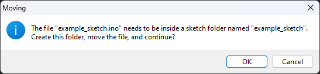
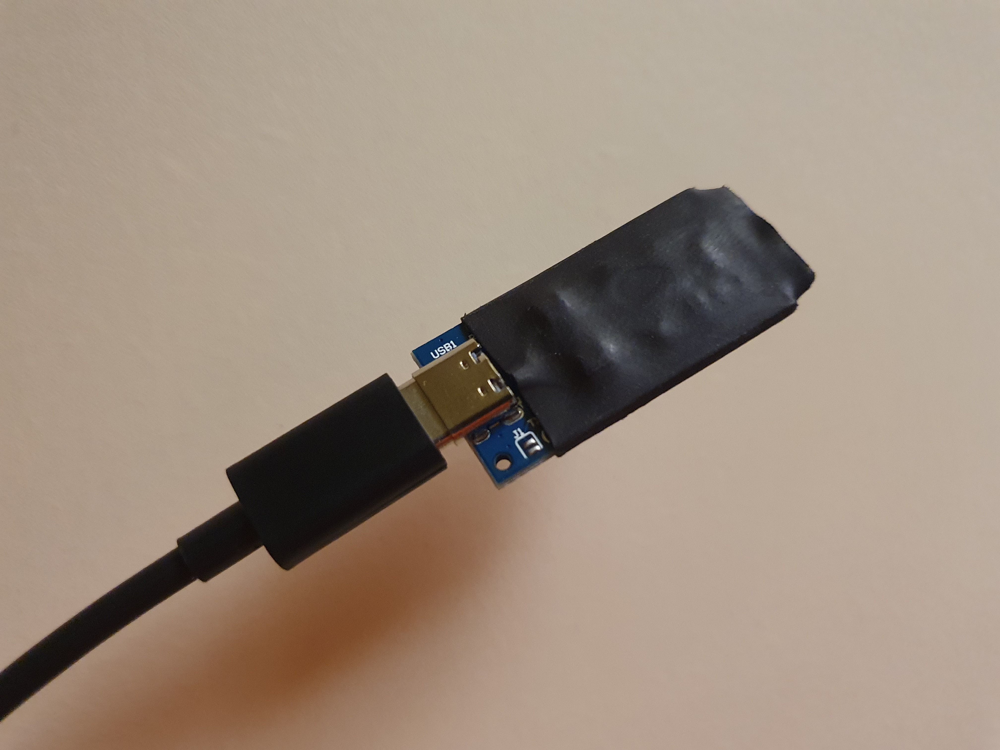

# BadUSB payloads
This repository is a collection of payloads, mostly for Arduino IDE compatible devices. I will also upload some DuckyScripts in the future, but I wanted to focus on affordable devices.

An official USB Rubber Ducky from Hak5 is great for a professional, but not so much for someone who just wants to play around and learn. Not counting Payload Studio PRO, it might not be the best option for most of us, and the Flipper Zero isn't cheap either, but something like an Arduino clone or a Digispark can cost only a few bucks with the possibility of using a free IDE.

Here is a list of compatible devices:
- ATtiny85
  - Digistump Digispark
- ATmega32U4
  - Arduino Leonardo
  - Arduino Micro
  - Arduino Leonardo clones

## How to use

Download the repository files using either _Download ZIP_ or `git clone`.

Arduino requires the sketch to be in a folder with the same name, but don't worry. Even if the files aren't inside their folder, Arduino will ask you to do so the first time you open the sketch.

All `.ino` files contain everything you need to make the sketch work.

> Each device folder has its own README.md with instructions on how to set everything up.

## Tips

I used heat shrink tubing on the boards. This way I can easily manage them without worrying about damaging the electronics.

I would suggest using a clear one, so you can easily see the LEDs on the device. Mine was black simply because that was all I had at the time.

